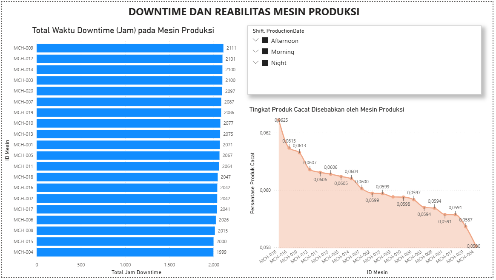
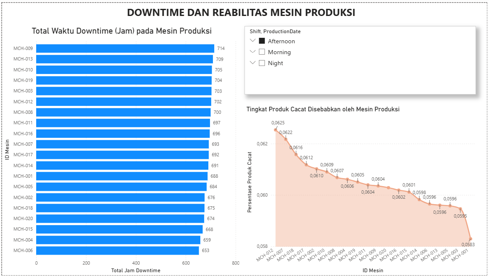
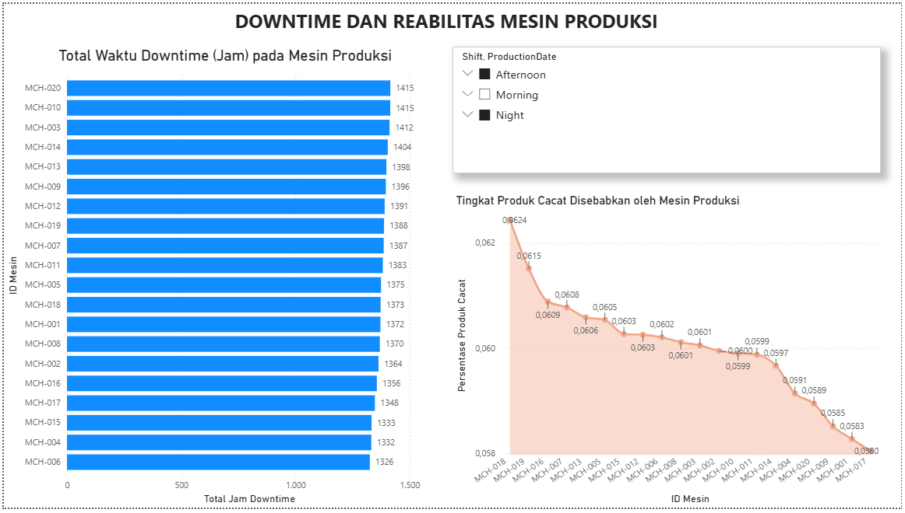
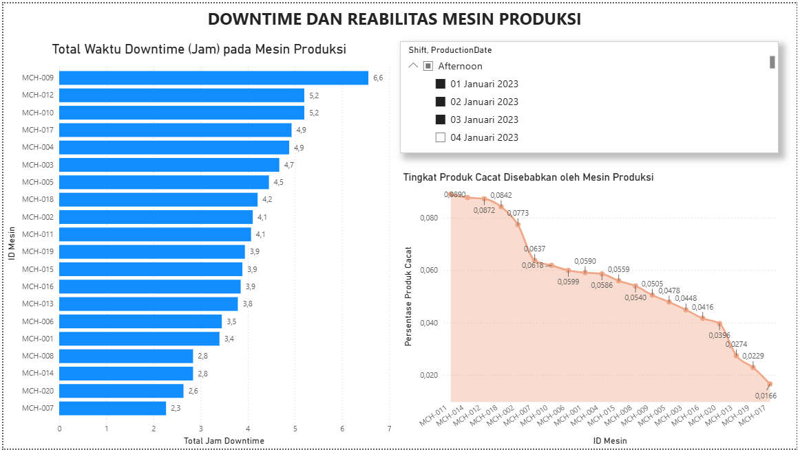
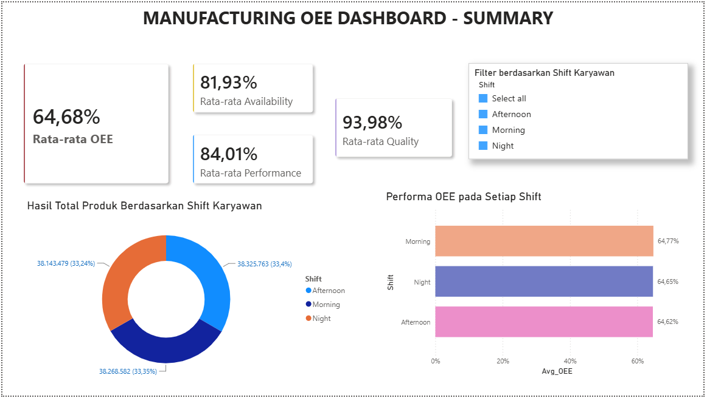
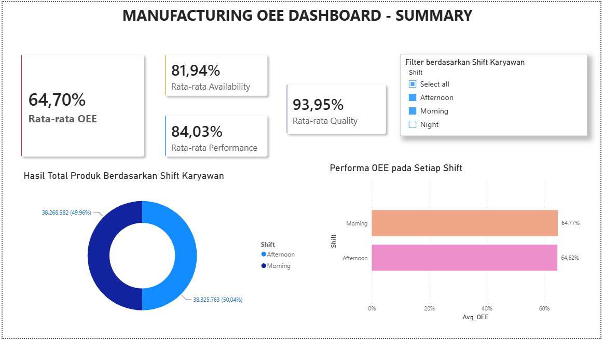
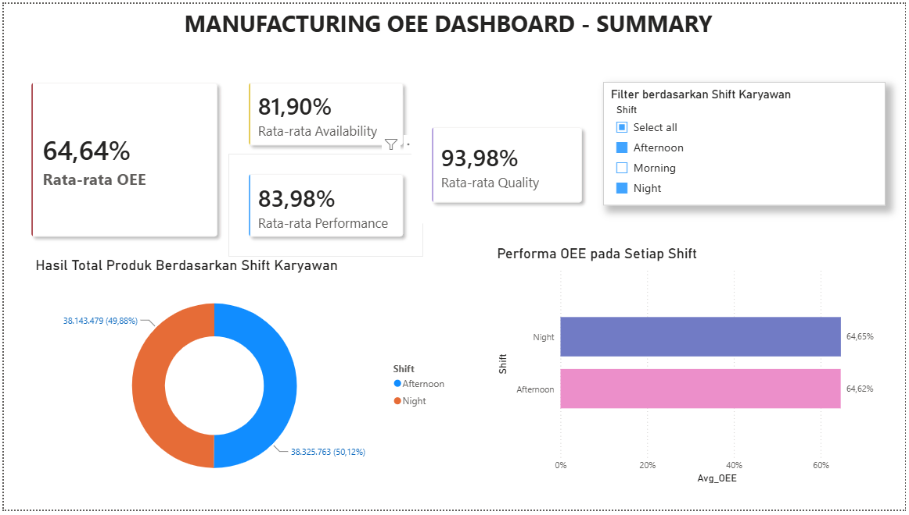

  <h3>DATA ANALYST & BUSINESS ANALYST PORTFOLIO</h3>
  <h2>Production Performance Monitoring and Downtime Reduction Analysis (OEE)</h2>
  
<b>Created by:</b> Damar Djati Wahyu Kemala | <b>Role:</b> Aspiring Data & Business Analyst (Ex-SIMRS Developer)

  
<i>© 2026 Damar Djati Wahyu Kemala</i>

  

## 1. Prologue
Dalam industri manufaktur modern, efektivitas peralatan dan transparansi operasional adalah kunci utama untuk menekan biaya produksi dan menghindari kerugian akibat mesin berhenti (*downtime*). Proyek ini berfokus pada pembangunan dashboard analitik interaktif dua halaman menggunakan **Power BI** untuk memantau, menganalisis, dan mengevaluasi kinerja lini produksi berdasarkan metrik standar internasional: **Overall Equipment Effectiveness (OEE)** beserta 3 faktor utamanya (*Availability, Performance,* dan *Quality*).

---

## 2. Tujuan Analisis (Business Objectives)
Tujuan utama dari analisis ini adalah,
* **Optimalisasi Efisiensi Mesin:** Memantau skor OEE secara real-time dan bertujuan untuk memastikan proses produksi berjalan mendekati standar ideal (OEE > 85%)  sumber : <i>(Seiichi Nakajima - Japan Institute of Plant Maintenance (JIPM))</i>.

* **Meminimalisir Downtime:** Mengidentifikasi mesin (*equipment*) yang paling sering mengalami kerusakan atau berhenti beroperasi untuk menyusun cara pencegahan dan membuat sebuah sistem alert (worklist) sebagai solusi.

* **Evaluasi pada Shift Kerja Karyawan:** Menganalisis stabilitas performa operasional dan distribusi volume output di antara Shift Pagi, Shift Siang, dan Shift Malam.
* **Peningkatan Kualitas Produk:** Menekan tingkat kegagalan produk dengan melacak mesin mana yang memberikan kontribusi *defect rate* tertinggi.

---

## 3. Business Objectives & Problem Statements
* **Sulit Menemukan Akar Masalah Downtime:** Manajemen mengetahui adanya penurunan total volume produksi, namun kesulitan melacak mesin spesifik mana yang paling banyak menyita waktu kerja akibat downtime.

* **Kualitas Produk yang Tidak Konsisten:** Terjadinya lonjakan produk cacat (*defect rate*) pada waktu-waktu tertentu tanpa ada visualisasi yang mampu menghubungkan performa mesin dengan kualitas output secara langsung.

* **Ketidakpastian Kinerja Antar Shift:** Tidak adanya metrik pembanding yang adil untuk melihat apakah penurunan efisiensi murni karena faktor mesin atau adanya ketimpangan performa kerja antar-shift operator.

---

## 4. Dataset Architecture & Schema
* **Source:** infoveave - (manufacturing-oee)
* **Total Records:** 30000 rows
* **Technology Stack:** SQL Server (T-SQL), VS Code, Microsoft Excel, Power BI.

---

## 5. Executive Insights & Core Analysis

### Analisis Efisiensi Berdasarkan Shift Kerja
* **Tujuan:** Mengidentifikasi pengaruh faktor operasional produksi yaitu karyawan dari sisi pembagian waktu kerjanya terhadap produktivitas dan bertujuan untuk mengetahui kebocoran pada efektivitas pembagian shift kerja.
* **Key Finding:** Model Shift yang Tidak perlu di Rombak / Diubah Strukturnya, Perlu Adanya Kedispilinan pada Respon Teknisi Lintas Shift.
* **[Detail Laporan Angka & Query SQL Analisis 1](./query_documentation/Analisis_Efisiensi_Berdasarkan_Shift_Kerja.md)**

### Analisis Faktor Penyebab Downtime
* **Tujuan:** Menghitung akumulasi waktu mati / downtime mesin dalam satuan jam, dengan tujuan menemukan mesin-mesin yang menyebabkan waktu produksi berkurang, serta mengukur kebocoran operasional di bagian produksi.
* **Key Finding:**  Pengelompokan cara penanganan berdasarkan karakteristik kerusakan, Seperti Alat Medis, pada Mesin Produksi perlu adanya SMED (Single-minute-exchanged of die), Perlu Adanya Worklist Alert dan modul Restocking pada Sparepart Mesin dan Penjadwalan Maintance Teknisi.
* **[Detail Laporan Angka & Query SQL Analisis 2](./query_documentation/Analisis_Faktor_Penyebab_Downtime.md)**

### Analisis Mencari Mesin dengan OEE Terendah
* **Tujuan:** Mengidentifikasi Mesin produksi yang memiliki efektivitas paling rendah di lantai produksi dengan tujuan menentukan prioritas alokasi perbaikan mesin (maintance dan operasional).
* **Key Finding:** Fokus perbaikan pada Faktor Availability, Perlunya Audit dan Perbaikan Total, SOP standarisasi pada setup Mesin.
* **[Detail Laporan Angka & Query SQL Analisis 3](./query_documentation/Analisis_Mencari_Mesin_dengan_OEE_Terendah.md)**

### Analisis Waktu Mesin Mati dan Produk Cacat
* **Tujuan:** Melihat hubungan korelasi antara waktu downtime mesin produksi terhadap produk cacat yang dihasilkan.
* **Key Finding:** Mengatasi masalah Defect (Produk Cacat) yang dapat diatasi dengan diturunkannya tim Quality Assurance untuk memastikan agar produk defect dapat diminimalisir.
* **[Detail Laporan Angka & Query SQL Analisis 4](./query_documentation/Analisis_Waktu_Mesin_Mati_dan_Produk_Cacat.md)**

---

## 6. Struktur Data dan Pembersihan Data
Dataset ini terdiri dari 30.000 baris data. Beberapa proses *data cleaning* dilakukan di Excel dan SQL Server meliputi:

* **Konversi Teks Durasi ke Desimal:** Data mentah pada kolom waktu (seperti jam kerja dan *downtime*) awalnya bertipe teks (*String*) yang tidak bisa dihitung atau dijumlahkan secara matematis dari data mentah ke power query di excel. 

* **Proses Ekstraksi pada Power Query sebelum visualisasi**: Teks data hasil olah di sql server, diekstrak, dan dikonversi menjadi tipe data **Desimal** di beberapa kolom tertentu di power query pada Power BI. Langkah ini memungkinkan formula DAX di POWER BI dapat melakukan agregasi matematika dengan baik.

* **Format region Indonesia menjadi English (US):** dalam proses import data dari excel ke sql server, terutama ada pada delimiter yang menjadi pembeda yaitu pembacaan desimal.

---

## 7. Power BI Dashboard Preview

| 1. Downtime Dan Reabilitas Mesin Produksi | 2. Downtime Dan Reabilitas Mesin Produksi Hasil Filter | 3. Downtime Dan Reabilitas Mesin Produksi Hasil Filter 2 | 4. Downtime Dan Reabilitas Mesin Produksi Hasil Filter 3 |
| :---: | :---: | :---: | :---: |
|  |  |  |  |

| 1. Manufacturing OEE Dashboard Summary | 2. Manufacturing OEE Dashboard Summary Hasil Filter | 3. Manufacturing OEE Dashboard Summary Hasil Filter 2 |
| :---: | :---: | :---: |
|  |  |  |

---

## Copyright Personal Portfolio
* **Project Owner / Created By:** Damar Djati Wahyu Kemala
* **Role:** Aspiring Data Analyst & Business Analyst (Ex-SIMRS Developer)
* **Date Created:** Juni 2026
* **GitHub Portfolio:** [https://github.com/dams-code](https://github.com/dams-code)

---
*© 2026 Damar Djati Wahyu Kemala. This project is a part of my professional data analyst portfolio. Authorization is required for commercial use or modification.*
